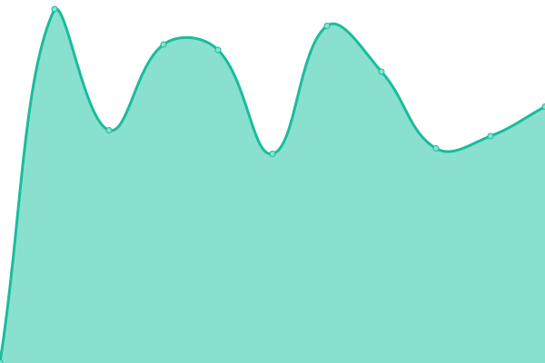

# [📈 Live Status](https://knilessew.github.io/upptimeKnilessew): <!--live status--> **🟩 All systems operational**

This repository contains the open-source uptime monitor and status page for [Auke Wesselink](https://knilessew.github.io/upptimeKnilessew), powered by [Upptime](https://github.com/upptime/upptime).

With [Upptime](https://upptime.js.org), you can get your own unlimited and free uptime monitor and status page, powered entirely by a GitHub repository. We use [Issues](https://github.com/knilessew/upptimeKnilessew/issues) as incident reports, [Actions](https://github.com/knilessew/upptimeKnilessew/actions) as uptime monitors, and [Pages](https://knilessew.github.io/upptimeKnilessew) for the status page.

<!--start: status pages-->
<!-- This summary is generated by Upptime (https://github.com/upptime/upptime) -->
<!-- Do not edit this manually, your changes will be overwritten -->
<!-- prettier-ignore -->
| URL | Status | History | Response Time | Uptime |
| --- | ------ | ------- | ------------- | ------ |
|  [ThuisIP](217.27.229.52) | 🟩 Up | [thuis-ip.yml](https://github.com/knilessew/upptimeKnilessew/commits/HEAD/history/thuis-ip.yml) | 

 107ms
     
 | 

<a href="https://knilessew.github.io/upptimeKnilessew/history/thuis-ip">100.00%</a>
    

|  [Alpacamundo PRD](https://alpacamundo.eu) | 🟩 Up | [alpacamundo-prd.yml](https://github.com/knilessew/upptimeKnilessew/commits/HEAD/history/alpacamundo-prd.yml) | 

 723ms
     
 | 

<a href="https://knilessew.github.io/upptimeKnilessew/history/alpacamundo-prd">100.00%</a>
    

|  [Alpacamundo PRD API Healthcheck](https://api.alpacamundo.eu/api/health) | 🟩 Up | [alpacamundo-prd-api-healthcheck.yml](https://github.com/knilessew/upptimeKnilessew/commits/HEAD/history/alpacamundo-prd-api-healthcheck.yml) | 

 640ms
     
 | 

<a href="https://knilessew.github.io/upptimeKnilessew/history/alpacamundo-prd-api-healthcheck">100.00%</a>
    

|  [Alpacamundo PRD DB Check](https://api.alpacamundo.eu/api/alpacas) | 🟩 Up | [alpacamundo-prd-db-check.yml](https://github.com/knilessew/upptimeKnilessew/commits/HEAD/history/alpacamundo-prd-db-check.yml) | 

 371ms
     
 | 

<a href="https://knilessew.github.io/upptimeKnilessew/history/alpacamundo-prd-db-check">100.00%</a>
    

|  [Alpacamundo TST](https://tst.alpacamundo.eu) | 🟩 Up | [alpacamundo-tst.yml](https://github.com/knilessew/upptimeKnilessew/commits/HEAD/history/alpacamundo-tst.yml) | 

 646ms
     
 | 

<a href="https://knilessew.github.io/upptimeKnilessew/history/alpacamundo-tst">100.00%</a>
    

|  [Alpacamundo TST API Healthcheck](https://api-tst.alpacamundo.eu/api/health) | 🟩 Up | [alpacamundo-tst-api-healthcheck.yml](https://github.com/knilessew/upptimeKnilessew/commits/HEAD/history/alpacamundo-tst-api-healthcheck.yml) | 

 604ms
     
 | 

<a href="https://knilessew.github.io/upptimeKnilessew/history/alpacamundo-tst-api-healthcheck">100.00%</a>
    

|  [Alpacamundo TST DB Check](https://api-tst.alpacamundo.eu/api/alpacas) | 🟩 Up | [alpacamundo-tst-db-check.yml](https://github.com/knilessew/upptimeKnilessew/commits/HEAD/history/alpacamundo-tst-db-check.yml) | 

 370ms
     
 | 

<a href="https://knilessew.github.io/upptimeKnilessew/history/alpacamundo-tst-db-check">100.00%</a>
    

|  [Alpacamundo TST API Swagger](https://api-tst.alpacamundo.eu/swagger/index.html) | 🟩 Up | [alpacamundo-tst-api-swagger.yml](https://github.com/knilessew/upptimeKnilessew/commits/HEAD/history/alpacamundo-tst-api-swagger.yml) | 

 108ms
     
 | 

<a href="https://knilessew.github.io/upptimeKnilessew/history/alpacamundo-tst-api-swagger">100.00%</a>
    

<!--end: status pages-->

[**Visit our status website →**](https://knilessew.github.io/upptimeKnilessew)

## 📄 License

- Powered by: [Upptime](https://github.com/upptime/upptime)
- Code: [MIT](./LICENSE) © [Anand Chowdhary](https://anandchowdhary.com), supported by [Pabio](https://pabio.com)
- Data in the `./history` directory: [Open Database License](https://opendatacommons.org/licenses/odbl/1-0/)
